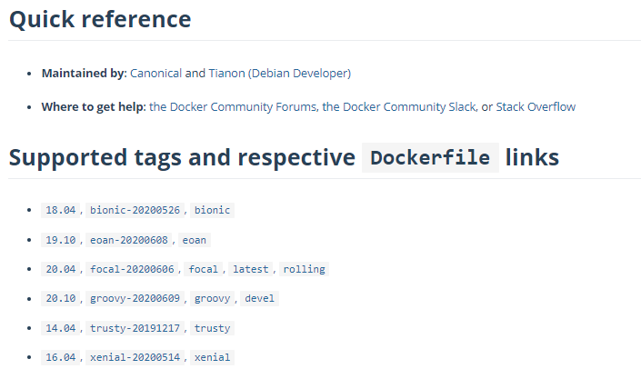
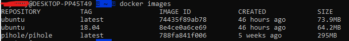
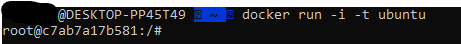
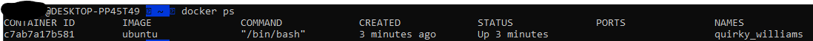

Most people will be basing their application containers on a base image from Docker Hub in one way or another.

Images are made up of *layers*.  Each layer is a tarball that contains the a 'snapshot' of the changes to a filesystem
at a given step of the build process (we'll get into that later).  Layers are overlaid on top of one another as part of
a unioned filesystem.

We're going to get a base image based on Ubuntu 20.04 and then get to a shell on it.

## Pulling the image
We can find a lot of base images on [Docker Hub](https://hub.docker.com).  In this case, we will be grabbing the image
for Ubuntu 20.04.

We can find information for the `ubuntu` base image on the 
[Docker Hub page for the image](https://hub.docker.com/_/ubuntu).

If you go to that page, you'll see a list of tags:


Tags are a way of describing a given image.  In the image above, we can see that there is a tag for `20.04`, but there
is more listed after that.  These are all pointing to the same build right now.  However, we can safely assume a few
things about their tagging system:
* `20.04` and `focal` should always be in step with each other (Focal is the codename of the release).  If we use 
`20.04` as the tag for our base image, it should always return the latest release version within Ubuntu 20.04.
* `focal-20200606` is a time-stamped image.  This should always point to this exact image and should never change, 
similar to pointing to a specific version of a binary.
* `latest` is generally applied to the most recent **stable** build of an image.  In October of 2020, this tag will
point to the release based on 20.10.  This tag will likely follow new major versions of the underlying software.  It is
important to not that `latest` is the assumed default tag when no tag is given.

Since we want to make sure we have Ubuntu 20.04, let's run:
```
docker pull ubuntu:20.04
```

This will download the latest version of Ubuntu 20.04 as a Docker image.  Note that we can have multiple versions
of an image pulled.  If I pull `ubuntu:18.04`, I can have that version happily coexisting with the 20.04
image.  Let's check this - go ahead and pull that image now.

To see what images we've pulled, we can run this command:
```
docker images
```

We should see something like this:


As you can see, `ubuntu:latest` (which is currently an alias for 20.04) and `ubuntu:18.04` can exist simultaneously.

But we don't need that image, so let's delete it with
```
docker rmi $IMAGE
```

## Running a docker image
Now that we have the image, we can run a command inside it!

```
docker run -i -t ubuntu
```

When we do this, we will have a root terminal inside the image.


From here, we can do just about anything we would expect to be able to do with an Ubuntu machine - install software 
using `apt`, run applications, etc.

## Listing running docker containers
It's not uncommon to need to see what is running through Docker.  To do this: 
```
docker ps
```

We'll get a list of the running containers:


Notice how the `name` for this is `quirky_williams`?  This is a randomly generated and assigned identifier unique to
this particular process.  If we want to stop it, we can do so:

```
docker stop quirky_williams
```

We can also replace this with the container ID, but the names are there to make it easier to recognize things.

When we stop a container, any changes are saved to their own layer, and we can 'resume' the container with
```
docker start quirky_williams
```

After this, we can get another shell by running:
```
docker exec -i -t quirky_williams /bin/bash
```

In the above example, we have a few new things to explain.  `exec` is used to run a specific command within a container.
`-i` informs Docker to run it interactively, and `-t` informs it to treat it as a TTY.  `/bin/bash` is the path to the
executable we want to run (in this case, the bash shell).

## Note
While we won't go into it right now, it's very important to understand the layers concept as applied to Docker.  Since
layers are tarballs laid on top of one another, they are downloaded by an end user and can be examined as such.
Especially if an image is going to be made public, **never put sensitive information directly into a Docker container,
even if they are deleted at a later time**.  There is one exception to this, but we will talk about it much later.


