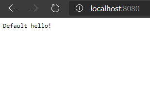
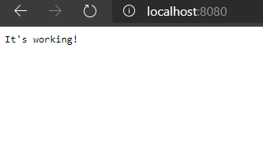

When we're doing actual development, or running docker containers in a production environment, there are certain things
we need to be able to do.

For these examples, we'll be using the `build` directory.  The Go binary built from this will read the `HELLOSTRING`
environment variable and start an HTTP server on port 8080, and all requests to `:8080/` will print the value of 
`HELLOSTRING`

## Port Forwarding
Let's start off easy.  From this directory (not inside `build`), go ahead and build this image:
```
docker build . -t part2
```

Now run it:
```
docker run part2
```

The service is now running on port 8080, so go ahead and try going to [localhost:8080](http://localhost:8080).

It failed, right?  That's because port 8080 is being used from within the container, which isn't necessarily accessible
from your host machine.  So stop the container, and we'll take a look at how to do port mapping.

We can specify that port 8080 on the host (i.e., `localhost:8080` ) should point to port 8080 inside the running
container.  

```
docker run -p 8080:8080 part2
```

Now we can go to [localhost:8080](http://localhost:8080) again and...



Success!

### What's going on here
When we specify `-p 8080:8080` on the command line, we are telling it to take traffic from port 8080 in the container
(the 'second' 8080) and publish it at localhost:8080 (the first 8080).  The -p option stands for "publish", if that
helps you remember.

If you look in the Dockerfile, you'll see this line:
```
EXPOSE 8080
```

This tells Docker to 'expect' that we will be using port 8080 inside the container and make the port available to other
containers for access.

We can also use expose to put up all the ports exposed to the world:
```
docker run -P part2
```

Now if we run `docker ps`...
```
CONTAINER ID        IMAGE               COMMAND                 CREATED             STATUS              PORTS                     NAMES
882602a6f9f3        part2               "/go/src/build/build"   4 minutes ago       Up 4 minutes        0.0.0.0:32768->8080/tcp   hopeful_elgamal
```

As you can see, we can now get the list of *randomly assigned* ports in use by the container.  In this case, port 32768
is mapped to port 8080 inside the container.

Before moving on, be sure to kill all the containers we've started up!

## Environment variables
So now we can access the server.  We want it to display something different now.  We can change what it says with the
environment variable `HELLOSTRING`.  So let's set that environment variable:

```
docker run -p 8080:8080 --env HELLOSTRING="It's working!" part2
```

Now when we go to [localhost:8080](http://localhost:8080) we will be greeted by the text `It's working!`



## Notes about publish ports and environment variables
Both the `--publish` (`-p`) and `--env` flags can be chained together by putting multiples, i.e., 
`--env ENV1=this --env ENV2=that`.

## Running detached
Notice how every time we run a container, we end up with our terminal just staying there?  We can get back to our
prompt by running the container in *detached* mode.  All we have to do is run with the `-d` flag.

```
docker run -d part2
```

And we're back to our command prompt.  Easy!